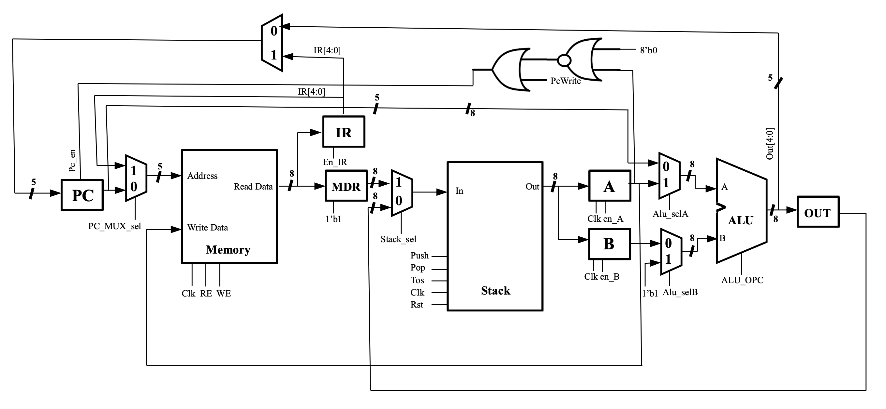

# Multi-Cycle-Stack-Based-Processor

This repository contains an implementation of a **stack-based processor** with a **multi-cycle architecture**.

##  Supported Instructions
The processor supports the following instructions:

- **Arithmetic & Logical:**
  - `add` – Add the top two elements of the stack
  - `sub` – Subtract the top two elements of the stack
  - `and` – Bitwise AND of the top two elements
  - `not` – Bitwise NOT of the top element

- **Memory Reference:**
  - `push` – Push data from memory onto the stack
  - `pop` – Pop data from the stack into memory

- **Control Flow:**
  - `jmp` – Jump to a specified memory address
  - `jz` – Jump to a specified address if the top of the stack is zero

##  Architecture Overview
This processor utilizes a **single shared memory** for both instructions and data.  
- **Instruction Memory:** Upper section (indexes 0–6) is filled with program instructions.  
- **Data Memory:** Lower section (indexes 7–10) is used to store data.

## DataPath Diagram

A test file is provided to initialize the memory with sample instructions and data, enabling verification of the processor’s correct functionality.

> **Note:** This project was developed as part of the **Computer Architecture** course at **University of Tehran, S2025**.

